<div align="center">

# Seeker AI — Personal Investment Advisor 🇮🇳

**An AI-powered investment platform for Indian markets that behaves like a real financial advisor — not a chatbot.**

Seeker learns your financial profile through a 9-step onboarding, combines it with live NSE market data, company fundamentals, and technical indicators, and produces **structured, explainable, personalized** advice — a full 12-section advisory for every question.


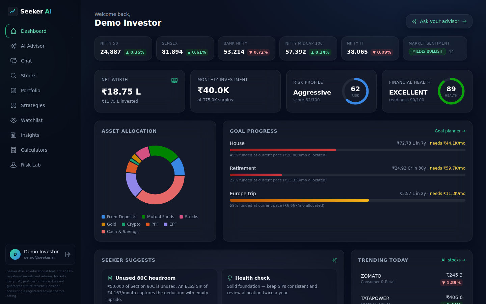

</div>

> ⚠️ **Disclaimer:** Seeker AI is an educational tool, not a SEBI-registered investment adviser. Markets carry risk; past performance does not guarantee future returns.

---

## 📑 Table of Contents

- [Highlights](#-highlights)
- [Screenshots](#-screenshots)
- [Features](#-features)
- [Tech Stack](#-tech-stack)
- [Architecture](#️-architecture)
- [Quickstart](#-quickstart)
- [Configuration](#-configuration)
- [Scripts](#-scripts)
- [Project Structure](#️-project-structure)
- [Roadmap](#️-roadmap)
- [License](#-license)

---

## ✨ Highlights

- 🧠 **Real advisor, not a chatbot** — every answer is a structured 12-section advisory with confidence scores and honest data notes.
- 🔢 **The math is deterministic** — risk scores, allocations, and a 1,000-path Monte Carlo simulation are computed by quant engines. The AI writes the explanation; it never invents a number.
- 📡 **Live Indian market data, keyless** — NSE/Yahoo provider chain with automatic fallbacks and caching.
- 🔌 **Zero-key demo mode** — the entire app runs fully offline with realistic sample data. No API keys required to explore every screen.
- 🔒 **Production-grade auth** — JWT access tokens + rotating, hashed refresh tokens, plus optional Google Sign-In.

---

## 📸 Screenshots

<table>
  <tr>
    <td width="50%">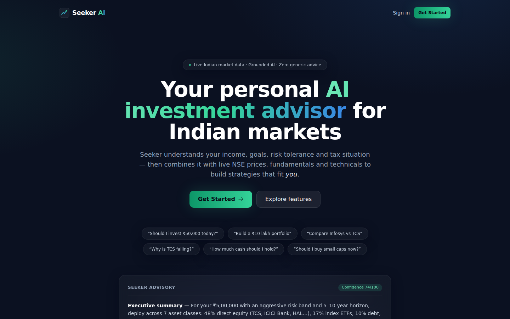<p align="center"><em>Landing</em></p></td>
    <td width="50%">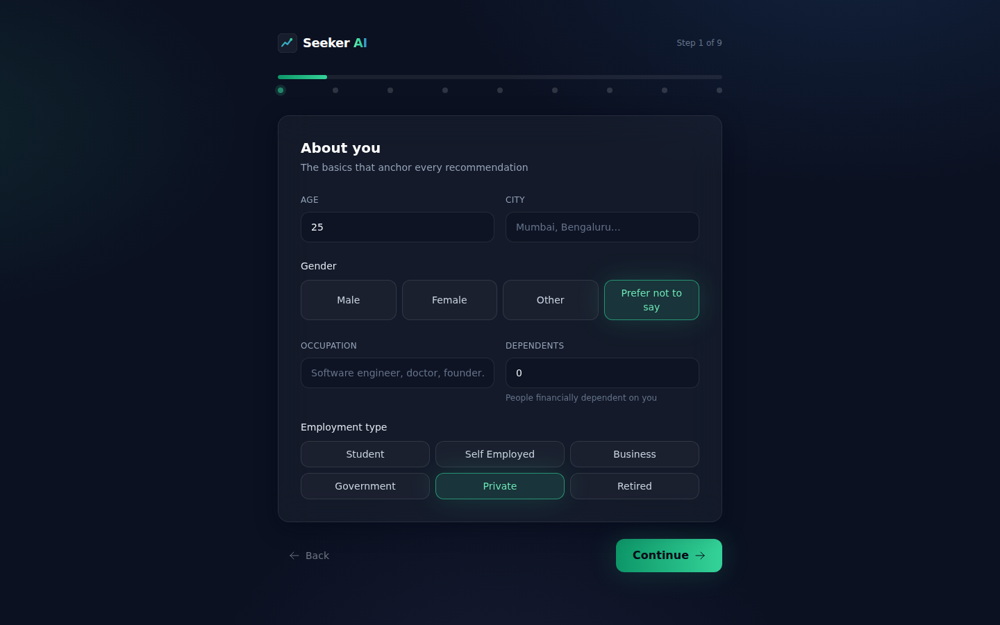<p align="center"><em>9-step onboarding</em></p></td>
  </tr>
  <tr>
    <td width="50%">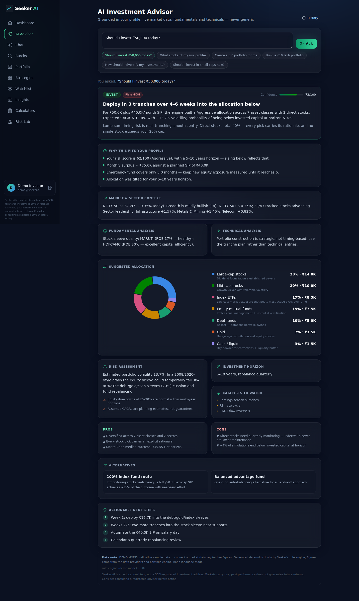<p align="center"><em>AI Advisor — 12-section advisory</em></p></td>
    <td width="50%">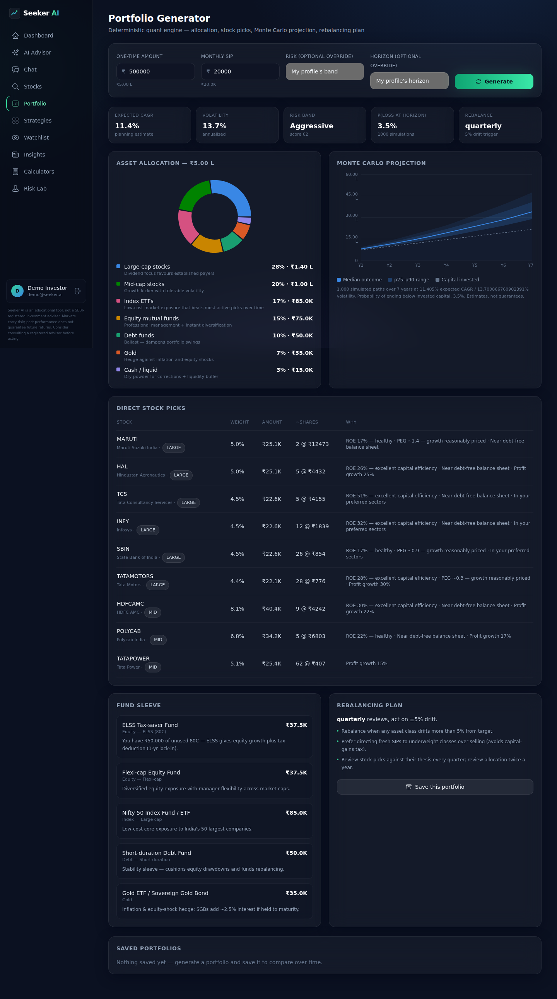<p align="center"><em>Portfolio engine + Monte Carlo</em></p></td>
  </tr>
  <tr>
    <td width="50%">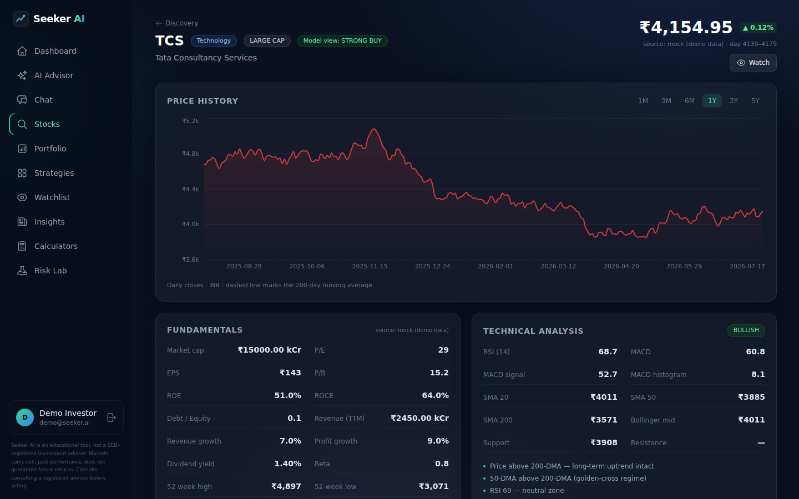<p align="center"><em>Stock discovery & analysis</em></p></td>
    <td width="50%">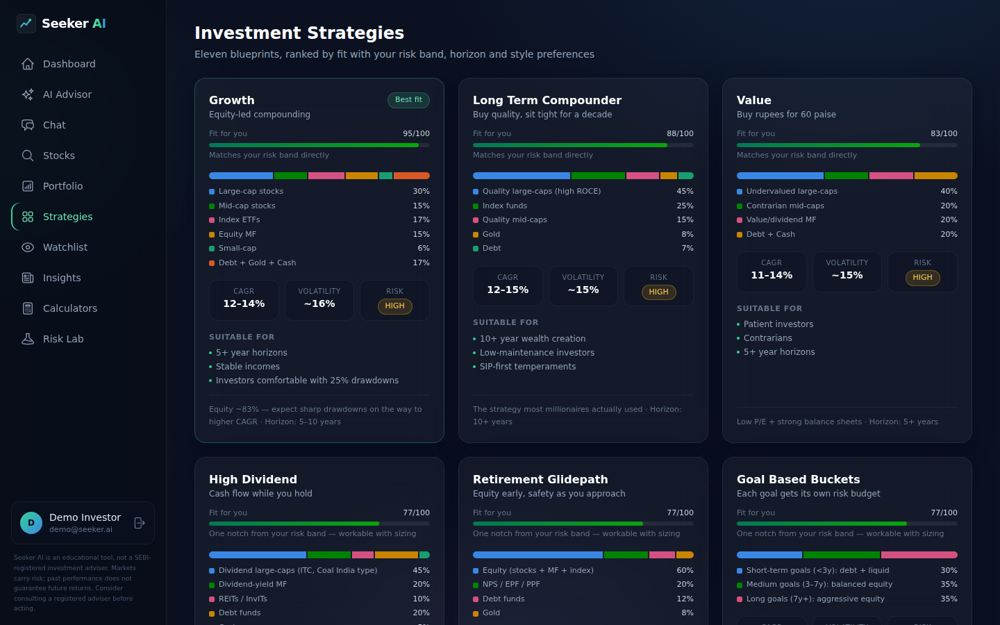<p align="center"><em>Strategy blueprints</em></p></td>
  </tr>
  <tr>
    <td width="50%">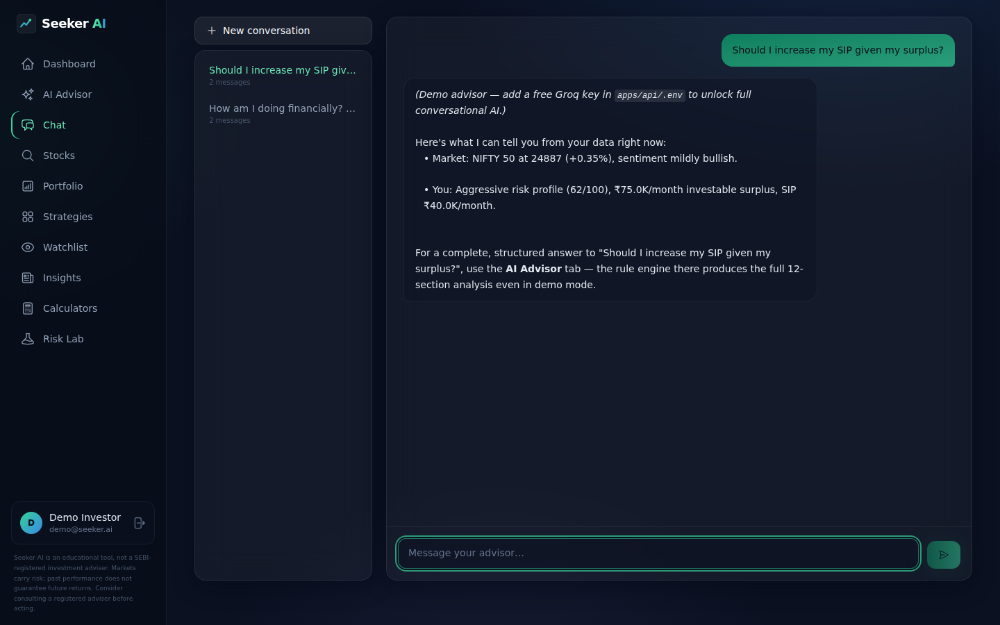<p align="center"><em>Conversational advisor</em></p></td>
    <td width="50%">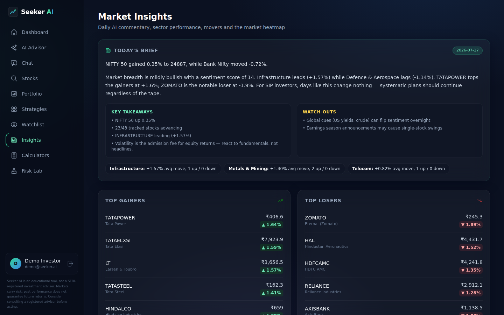<p align="center"><em>Daily market insights</em></p></td>
  </tr>
  <tr>
    <td width="50%">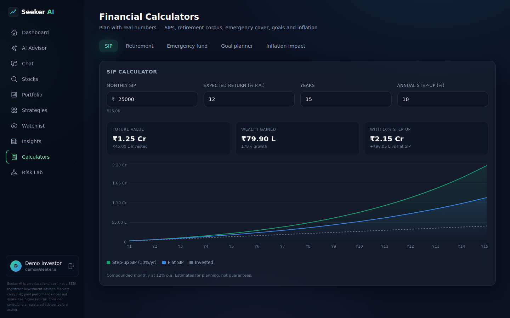<p align="center"><em>Financial calculators</em></p></td>
    <td width="50%">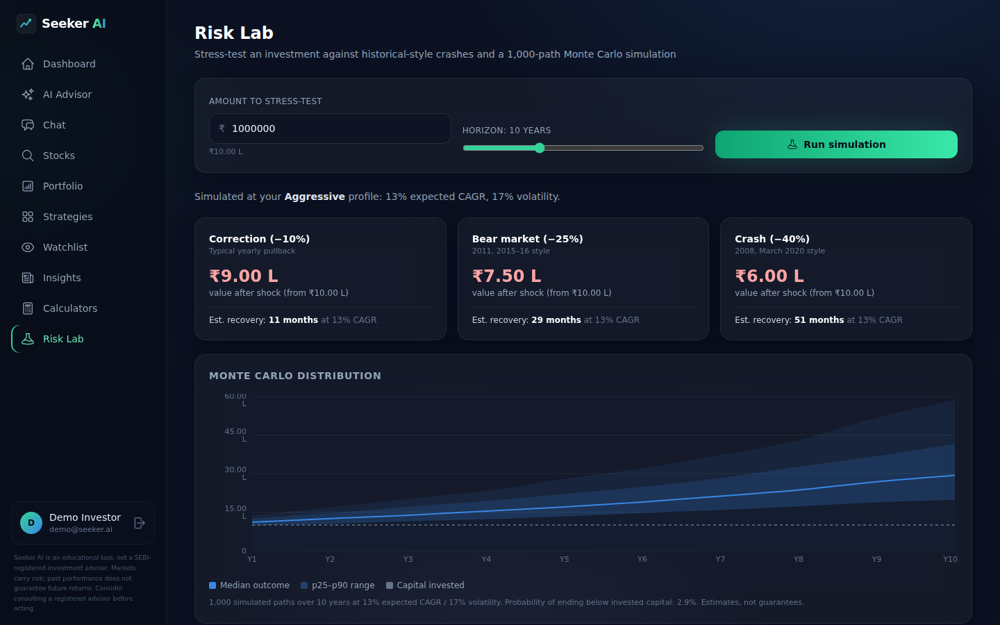<p align="center"><em>Risk Lab — crash scenarios</em></p></td>
  </tr>
</table>

---

## 🎯 Features

| Area | What it does |
|---|---|
| **Onboarding** | 9 steps: personal, income, financial situation, goals, a scenario-based risk quiz (score computed, never asked directly), horizon, amounts, preferences, tax |
| **Dashboard** | Net worth, financial-health & risk-score rings, goal progress with required-SIP math, asset-allocation donut, AI suggestions, indices strip (NIFTY / SENSEX / Bank Nifty), sentiment, trending stocks |
| **AI Advisor** | 12-section structured advisories (summary → recommendation → fit → market context → fundamental → technical → risk → allocation → horizon → risks → alternatives → action items) with confidence scores and honest data notes |
| **Stock Discovery** | Search any NSE stock; price chart with 200-DMA; PE/EPS/ROE/ROCE/D-E/dividend/52-week fundamentals; RSI/MACD/SMA/Bollinger/support-resistance technicals; news; per-user AI verdict |
| **Portfolio Engine** | Deterministic quant engine: risk-band allocation matrix with tilts, scored stock selection with sector caps and a single-stock guardrail, fund sleeve (ELSS-aware), expected CAGR/volatility, 1,000-path Monte Carlo, rebalancing plan |
| **Strategies** | 11 blueprints (Conservative → Momentum → Goal-based) ranked by a personalized fit score |
| **Watchlist & Alerts** | Follow stocks; price / %-move / RSI / news / fundamental alert rules |
| **Market Insights** | Daily AI commentary, top gainers/losers, sector performance, full market heatmap |
| **AI Chat** | Conversational advisor with your profile, portfolio, watchlist, and live data in context |
| **Calculators** | SIP (with step-up), retirement corpus, emergency fund, goal planner, inflation impact + Risk Lab |

---

## 🧰 Tech Stack

**Frontend** — React 18 · Vite 6 · TypeScript · Tailwind CSS · Framer Motion · Recharts · TanStack React Query · Zustand · React Router 6

**Backend** — Node.js 20+ · Express 4 · TypeScript · Prisma 6 · PostgreSQL 16 · Zod · JWT · bcrypt

**Shared** — a single `@seeker/shared` package holding all types, Zod schemas, constants, and finance math used by both apps.

---

## 🏗️ Architecture

A monorepo (npm workspaces) with three packages:

```
seeker-ai/
├── apps/
│   ├── api/          Express + TypeScript + Prisma (PostgreSQL)
│   │   └── src/modules/    auth · profile · market · portfolio · advisor ·
│   │                       chat · strategies · watchlist · insights · screener
│   └── web/          React 18 + Vite + Tailwind + Framer Motion + Recharts
│       └── src/features/   landing · auth · onboarding · dashboard · stocks ·
│                           advisor · portfolio · strategies · watchlist ·
│                           insights · chat · calculators
└── packages/shared/  Types, Zod schemas, constants, finance math (single source of truth)
```

**Design decisions worth knowing:**

- **Provider chain for market data** — `nse → yahoo → alphavantage → twelvedata → finnhub → mock`, configurable via `MARKET_PROVIDERS`. Each adapter implements one interface; failures fall through; results are cached with a stale-grace window, so brief outages degrade to "last known data" instead of errors. The `mock` provider is a deterministic offline dataset of 43 NSE stocks, so **every screen works with zero API keys**.
- **Provider-agnostic AI** — one interface, four adapters: OpenAI-compatible (covers **Groq**, OpenAI, OpenRouter, Together, Ollama), Anthropic, Gemini. Structured responses are validated against Zod schemas with one repair retry; if the LLM fails twice, a deterministic rule engine produces the same 12-section advisory. The user **always** gets a schema-valid response.
- **Grounded prompts** — the LLM only sees data blocks built server-side (profile, market snapshot, per-stock fundamentals/technicals, portfolio-engine output) and is instructed to cite them. It never invents numbers; the quant engine does the arithmetic.
- **Stateless API** — auth is via self-contained JWTs, so the API scales horizontally behind a load balancer.

---

## 🚀 Quickstart

**Prerequisites:** Node 20+ (22 recommended) and Docker (for PostgreSQL), *or* any PostgreSQL 14+.

```bash
# 1. Install (also builds the shared package + generates the Prisma client)
npm install

# 2. Start PostgreSQL
npm run db:up                      # docker compose — or point DATABASE_URL at your own PG

# 3. Configure
cp .env.example apps/api/.env      # defaults work for local dev; add keys later
cp apps/web/.env.example apps/web/.env

# 4. Create schema + demo user
npm run db:push
npm run db:seed                    # demo@seeker.ai / SeekerDemo1

# 5. Run both apps
npm run dev                        # api → :4000, web → :5173
```

Open **http://localhost:5173** and log in with **demo@seeker.ai / SeekerDemo1**, or sign up and walk through the onboarding.

---

## 🔑 Configuration

**Zero-key demo mode:** with no `.env` keys at all, the app runs fully offline — deterministic market data (clearly labeled), rule-engine advisories, and every page functional. Add keys incrementally to go live:

| Key | Unlocks | Where to get it |
|---|---|---|
| *(none)* | Live NSE/Yahoo market data — keyless, on by default | — |
| `GROQ_API_KEY` | Full LLM advisories + chat (generous free tier) | [console.groq.com](https://console.groq.com) |
| `GOOGLE_CLIENT_ID` | "Continue with Google" sign-in | Google Cloud Console |
| `ALPHAVANTAGE_API_KEY`, etc. | Extra market-data redundancy | respective providers |

---

## 📜 Scripts

| Command | What it does |
|---|---|
| `npm run dev` | Run API + web concurrently |
| `npm run build` | Build shared → api → web |
| `npm run typecheck` | Strict TypeScript across all workspaces |
| `npm run test:engines` | Engine smoke tests (indicators, scoring, allocation, Monte Carlo, advisor) — offline |
| `npm run db:push` / `db:migrate` / `db:seed` | Prisma schema + demo data |
| `npm start` | Run the built API |

---

## 🗂️ Project Structure

```
seeker-ai/
├── apps/
│   ├── api/          Backend — Express, Prisma, engines, AI + market-data layers
│   └── web/          Frontend — React SPA (feature-folder organized)
├── packages/
│   └── shared/       Shared types, Zod schemas, constants, finance math
├── db/
│   └── init.sql      Hand-maintained DDL fallback for offline environments
├── docker-compose.yml
└── .env.example
```

---

## 🗺️ Roadmap

- **Trust:** verify LLM-quoted numbers against the grounding blocks before enabling a live LLM key.
- **Data robustness:** add fundamentals redundancy and fill the ROCE gap so live analysis survives a provider outage.
- **Scale:** shared Redis cache + a background market refresher, connection pooling, and read replicas.
- **Reach:** a PWA + a React Native (Expo) mobile app for public testing.
- **Quality:** a proper test runner (Vitest), web/E2E tests, and a CI pipeline.
- **Accounts:** password reset + email verification for public launch.

---

## 📄 License

[MIT](LICENSE) — use it, learn from it, build on it.

---

<div align="center">

**Built and maintained by Jaskirat Singh.**

_If you find this useful, a ⭐ on the repo is appreciated._

</div>
